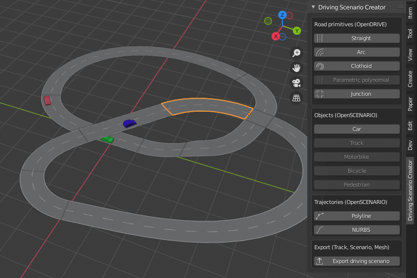

# Blender Driving Scenario Creator add-on

This [Blender](https://www.blender.org/) add-on lets you create OpenDRIVE and
OpenSCENARIO based scenarios for development and testing of advanced driver
assistance systems and autonomous driving functions.

## How to install

Prior to installing the add-on inside of Blender some requirements must be
installed. The process slightly differs for Linux and Windows.

###  Requirements Linux

For the sake of simplifying the following instructions let's assume that we
work with a Debian based Linux distribution (such as Ubuntu or Mint) and Blender
has been [downloaded](https://www.blender.org/download/) and installed to

    /opt/blender/

Then we first need to install the
[scenarigeneration](https://github.com/pyoscx/scenariogeneration) library into
the Blender Python environment since the add-on uses the library as a backend to
write OpenDRIVE and OpenSCENARIO files. Additionally,
[pyclothoids](https://github.com/phillipd94/pyclothoids) is needed which is used
by the add-on and the scenarigeneration lib as well. Navigate to your Blender
included Python installation

    cd /opt/blender/<blender_version>/python/bin

if pip is not already present in there then run (use sudo only if root is the
owner)

    sudo ./python<python_version> -m ensurepip

now install the lib(s)

    sudo -E ./python<python_version> -m pip install scenariogeneration

where the `-E` makes sudo preserve the exported environment variable. Note again
that `sudo` is not required in case Blender is installed to the user home
directory or the user has write access to the directory. Also make sure not to
not forget the `./` at the beginning such that the Python executable from within
the directory is used and not another instance on your system.

For the esmini export functionality we also need to install
[OpenSceneGraph](http://www.openscenegraph.org/) to have the `osgconv` tool
available. This is necessary because Blender is unable to directly export to the
.osgb scenegraph format, while esmini can only process this particular format.
On a Debian/Ubuntu/Mint system this can be achieved with

    sudo apt install openscenegraph

If you manually install OpenSceneGraph make sure that `osgconv` can be found
through your `PATH` environment variable, otherwise the export with .osgb 3D
model files will fail.

Install [esmini](ttps://github.com/esmini/esmini/releases). Preferably to
`/opt/esmini` and then put `/opt/esmini/bin` it in your `PATH` environment
variable with an `export PATH=$PATH:/opt/esmini/bin` at the end of the
`~/.bashrc`.

### Requirements Windows

Assuming Blender has been [downloaded](https://www.blender.org/download/) and
installed using the .msi installer, open PowerShell in admin mode by pressing
<kbd>Windows</kbd>+<kbd>X</kbd> and then then <kbd>A</kbd>.

In PowerShell navigate to the Blender install folder with (don't forget to
insert the version number)

    cd "C:\Program Files\Blender Foundation\Blender <blender_version>\<blender_version>\python\bin"

Run the following command to install the scenariogeneration library

    .\python -m pip install scenariogeneration --target ..\lib\site-packages

Note that you might be able to do this without admin rights in case you are
using the "Portable" version of Blender. Also if you are having trouble with
this part of the installation, consider starting over with a clean installation
of Blender and/or removing any leftovers of Python in your `%appdata%` folder.

Download and extract (for example to `C:\Tools\OpenSceneGraph`)
[openscenegraph](https://objexx.com/OpenSceneGraph.html).

Also download and extract (for exampe to `C:\Tools\esmini`)
[esmini](https://github.com/esmini/esmini/releases).

Add the OpenSceneGraph `bin` folder and the esmini `bin` folder to the `PATH`
environment variable using the "Edit environment variables for your account"
tool (look for it in the Windows start menu). Note that otherwise the export
with .osgb 3D model files will fail because `osgconv` can not be found by the
add-on.

### Add-on (Linux and Windows)

Finally download the driving scenario generator [release .zip
archive](https://github.com/johschmitz/blender-driving-scenario-creator/releases/).
Open Blender and go to Edit -> Preferences -> Add-ons. Click "Install...".
Select the .zip archive and confirm. Activate the add-on by ticking the little
box next to it, in the add-on list.

## How to use

Before using the add-on some preliminary settings are recommended.

### Recommended Blender settings

When you are in the Blender <kbd>Layout</kbd> workspace (see the tabs at the top), press
<kbd>N</kbd> or click the little left arrow next to the navigation gizmo to
toggle the sidebar. Click <kbd>View</kbd>, set `Clip Start` to 1 m and `Clip
End` to 10000 m to avoid some 3D viewport clipping issues since the Blender
default setting is targeted more towards smaller models. Click the
<kbd>Shading</kbd> dropdown button (the little down arrow in the top right
corner of the 3D viewport) and select `Texture` to be able to directly see the
road sign textures.

It is also very useful to make yourself familiar with the most important
shortcuts to navigate with the camera in the 3D viewport. The most important
ones are <kbd>Shift</kbd> + <kbd>Middlemouse</kbd> to pan and <kbd>Alt</kbd> +
<kbd>Middlemouse</kbd> to move the pivot point. The pivot point will
automatically be placed on the surface of an object when it is under the mouse
pointer which is extremely useful. The view can be rotated by holding
<kbd>Middlemouse</kbd>. Additionally, the `View` Pie Menu is very useful to see
the scene from different fixed angles. It can be opened with the <kbd>\`</kbd>
(backtick) button on the US keyboard layout, alternatively use the Numpad
shortcuts or go to `Edit -> Preferences -> Input -> Emulate Numpad` and use the
<kbd>1</kbd>-<kbd>9</kbd> keys. Hint for German keyboard layouts: go to `Edit ->
Preferences -> Keymap -> 3D View -> 3D View (Global) -> View` and add the
<kbd>Ctrl</kbd> modifier key to the shortcut. Then it will work with the
<kbd>^</kbd> key which is in the same location as the <kbd>\`</kbd> key in the
US keyboard layout (above the <kbd>Tab</kbd> key).

### Using the actual add-on

Click <kbd>Driving Scenario Creator</kbd> in the sidebar. From here you can
create roads and vehicles using the mouse by clicking the buttons in the
"Driving Scenario Creator" menu. Roads, signs, vehicles and trajectories can be
placed with the mouse. Junction connecting roads can be build using the mouse
similar to normal roads after first building a junction area. The cursor will
snap to the lanes of the incoming roads in this case. Note, that in Blender it
is possible to quickly left click multiple times in order to select objects
which are located on top of each other. This helps with selecting and deleting
junction connecting roads. Grid snapping can be activated by holding
<kbd>Ctrl</kbd>. Additional geometry sections can be added by holding
<kbd>Shift</kbd> and clicking. Start heading of a road can be adjusted by
holding <kbd>Alt</kbd> and moving the mouse pointer. For the clothoid geometry
using the Hermite solver the end heading can be adjusted by holding
<kbd>Shift</kbd> and moving the mouse wheel. Road elevation can be changed by
holding <kbd>E</kbd>(3D view) or <kbd>S</kbd>(sideview) keys and moving the
mouse. After placing roads, road signs can be attached to them and placed at the
side. Finally, vehicles can be placed and a trajectory can be assigned to them.

| Keyboard Shortcut                                     | Function                             |
| ----------------------------------------------------- | ------------------------------------ |
| <kbd>N</kbd> (vanilla Blender)                        | Toggle sidebar with add-on main menu |
| Hold <kbd>Ctrl</kbd>                                  | Activate grid snapping               |
| Hold <kbd>Shift</kbd> + <kbd>Mouseleft</kbd>          | Add additional geometry section      |
| Hold <kbd>Alt</kbd>                                   | Change start heading of a road       |
| Hold <kbd>Shift</kbd> + <kbd>Mousewheel Up/Down</kbd> | Change end heading of a road         |
| Hold <kbd>E</kbd>                                     | Change road elevation (3D view)      |
| Hold <kbd>S</kbd>                                     | Change road elevation (sideview)     |

Before or after adding roads add additional Blender objects as desired. When
done modelling, export everything together by clicking <kbd>Export driving
scenario</kbd>. Choose a **directory** and a 3D file format (.fbx, .gltf, .osgb)
for the export and confirm.

## How to run exported scenarios

With esmini available the exported scenario can be run with

    cd <export_directory>
    esmini --osc xosc/bdsc_export.xosc --window 50 50 800 400

# How to develop

For development of the add-on the [Blender VS Code
extension](https://github.com/JacquesLucke/blender_vscode) is very
recommendable. It allows hot reloading and rapid iterations.

# How to run the test

There is a handful of tests for the geometries in the `tests/` directory. They
can be run by executing pytest from the Blender python distribution in the
project root directory

    /opt/blender/<blender_version>/python/bin/pytest

If pytest is not installed use pip to install it into the Blender directory as
described with the scenariogeneration library above.

The tests can also be run and debugged from within VS Code by adding the
following line to the `.vscode/settings.json` which is generated by VS Code when
configuring/scanning for the tests

    {
        ...
        "python.defaultInterpreterPath": "/opt/blender/<blender_version>/python/bin/python3.<python_version>",
        ...
    }

## License

The source code of this tool is distributed under the GPL version 3.0 license as
required for all Blender add-ons. Note, that this does not imply that the tool
can not be used in a commercial context. In fact, there is probably no issue
using it in the same way as you would use Blender itself, Linux or GCC since you
will probably not be modifying the source code and/or linking against it.

Furthermore, if your enterprise has already reached a state where open source
software contribution is possible or your business has embraced open source
software long ago, your contributions and pull requests are welcome if they are
maintainable.

## Credits

Credits for the current version go to
- [pyoscx/scenarigeneration](https://github.com/pyoscx/scenariogeneration)
  developers for the .xodr/.xosc generating/writing lib used as backend
- [Archipack](https://github.com/s-leger/archipack) add-on developer(s) for
  general Blender add-on tool inspiration
- [Blender VS Code extension](https://github.com/JacquesLucke/blender_vscode)
  for quick iterative development and hot reloading
- [pyclothoids](https://github.com/phillipd94/pyclothoids) which is a Python
  wrapper for Enrico Bertolazzi's
  [Clothoids](https://github.com/ebertolazzi/Clothoids) library
- Wikipedia and its contributors for the public domain ("gemeinfrei") German
  road sign textures and road stencil designs

## Main author/maintainer contact

Please open issues and pull requests on GitHub to discuss openly. For private
support inquiries contact the repository owner via email, Twitter or create an
issue to initiate the communication. If you consider contributing large new
features please consider to have a discussion before beginning with the clean
implementation.
